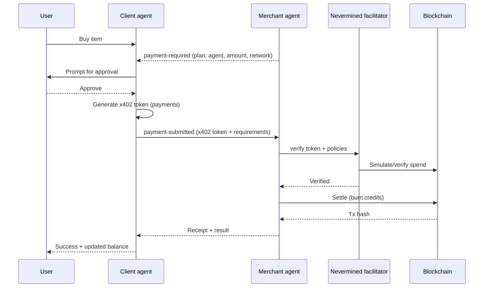

# Building Agentic Payments with Nevermined x402, A2A, and AP2

## TL;DR (Product)

Agents shouldn’t just talk—they should transact safely. Nevermined x402 adds programmable, on-chain payment permissions via smart account policies. A2A carries secure agent-to-agent messages, AP2 layers payment context, and x402 enforces what can be paid for. In the demo, a client agent buys from a merchant agent with real on-chain settlement, and every payment is explicitly approved and scoped by the user.

## TL;DR (Engineering)

The client agent generates x402 access tokens with `payments` ([payments-py](https://github.com/nevermined-io/payments-py)) using subscriber credentials. The merchant wraps business logic with an x402-aware executor, verifies, and settles on-chain through the Nevermined facilitator. A2A transports the payment-required/payment-submitted messages, AP2 standardizes the payment metadata, and smart account policies define what each x402 token can do: plan, agent, amount, network, and scheme. All setup and code are in [the demo README](https://github.com/nevermined-io/a2a-x402/blob/feat/a2a-nvm/python/examples/adk-demo/README.md).

---

## Why Agentic Payments Matter

For product teams, agentic payments unlock real revenue moments without bolting on fragile custom logic. Every payment request is transparent to the user, explicitly approved, and tightly scoped, so you maintain trust while shipping faster. Plans, products, and pricing live in the protocol layer—meaning pricing changes or new SKUs don’t require reworking agent code. Because settlement is on-chain, you get auditable, final transactions instead of best-effort logs. And since A2A/AP2/x402 are standards-based, your agents can interoperate with partners’ agents instead of being trapped in one ecosystem. The demo illustrates this with a client (subscriber) agent buying from a merchant (seller), showing on-chain verification, settlement, and clear user consent.

---

## How A2A, AP2, and x402 fit together

A2A is the reliable messaging rail between agents. AP2 adds payment semantics to those messages—who is requesting payment, for what plan, and how much. x402 then acts as the enforceable permission layer: the client signs an x402 access token that encodes the allowed plan, agent, amount, network, and scheme. The merchant validates that token, executes business logic, and settles on-chain through Nevermined. Together, A2A keeps the conversation coherent, AP2 keeps the payment intent explicit, and x402 keeps the payment enforceable.

## Flow overview (visual)

---

## How the flow works

1. The user asks the client agent to buy something.
2. The merchant agent responds with a payment-required message that specifies plan, agent, amount, network, and scheme (AP2).
3. The client prompts the user for approval.
4. The client calls `payments` ([payments-py](https://github.com/nevermined-io/payments-py)) to mint an x402 access token scoped by smart account policies.
5. The client sends the token and requirements to the merchant.
6. The merchant verifies via the Nevermined facilitator.
7. On success, the merchant runs business logic and settles on-chain, burning the authorized credits and returning a transaction hash.
8. The client fetches the updated balance and reports success.

In the demo, a single merchant can expose multiple payment methods—credits plans and pay-as-you-go—under the same agent. The facilitator (see the x402 facilitator concept [here](https://x402.gitbook.io/x402/core-concepts/facilitator)) plugs into x402 to verify and settle whichever plan is in use, so the flow stays identical while pricing models change. You can see real Base Sepolia settlements from the demo for pay-as-you-go [tx](https://sepolia.basescan.org/tx/0xf88cb8217505c25d8225c803332b4da6b4c18f93a51b384d4fdc0a9205512b7c) and for credits plans [tx](https://sepolia.basescan.org/tx/0xe476f4612bd2293954f64f493f04239a7867efcbc522e00daec6732a1ce6e5f3).

## The facilitator’s role

The facilitator is the enforcement and settlement bridge between x402 permissions and the chain. It takes the client’s x402 token and the merchant’s requirements, verifies that the requested spend fits policy (plan, agent, amount, scheme, network), and then settles on-chain by burning the allowed credits. Because it is protocol-aware, you can swap pricing models (credits vs. pay-as-you-go) without changing the agent conversation flow. For product teams, this means a consistent UX with pluggable monetization; for engineering teams, it means a single integration point that handles verification, settlement, and receipts.

## Smart account policies and x402 permissions

Smart account policies are the product control plane for payments. They define which plan a token can draw from, which agent it authorizes, how many credits it can burn, and on which network and scheme. Practically, this delivers safety and predictability: a token is valid only for the named agent and plan, it cannot exceed its credit allowance, and once credits are consumed the token fails gracefully. On-chain settlement enforces these limits, giving you auditability and customer-friendly guardrails (no surprise overages). This matches the smart-account extension in the Nevermined x402 integration and the broader positioning of x402 agent payments.

---

## Why this pattern scales

Separating payment protocol from business logic keeps agents maintainable while allowing commerce rules to evolve. Scoped permissions and explicit user approval provide safety; on-chain verification and settlement provide finality. Because A2A/AP2/x402 are standards-focused, merchants, clients, and facilitators can be swapped or composed without rewriting core flows.

---

## Try the demo and go deeper

Check out the demo repository and README for setup, run instructions, and deeper technical details: [a2a-x402 demo](https://github.com/nevermined-io/a2a-x402/blob/feat/a2a-nvm/python/examples/adk-demo/README.md). It covers environment setup, x402 token generation on the client side, server verification and settlement via the `payments` ([payments-py](https://github.com/nevermined-io/payments-py)) facilitator, AP2 message shapes, and full sequence diagrams and logs.

---

## Key takeaways

Agentic payments require consent, scoped permissions, and verifiable settlement—x402 plus Nevermined deliver that. Smart account policies make permissions programmable and enforceable. A2A/AP2 keep messaging and payment intent standardized so agents can coordinate cleanly. The demo is production-leaning: real on-chain verification and settlement with a clear separation between business logic and payment protocol.

---

## References

- [payments-py SDK](https://github.com/nevermined-io/payments-py)
- [a2a-x402 demo README](https://github.com/nevermined-io/a2a-x402/blob/feat/a2a-nvm/python/examples/adk-demo/README.md)
- [x402 facilitator concept](https://x402.gitbook.io/x402/core-concepts/facilitator)
- [Nevermined x402 integration notes](https://github.com/nevermined-io/contracts/blob/main/docs/x402/NVM-x402_integration.md)
- [Nevermined + x402 positioning](https://www.linkedin.com/pulse/nevermined-x402-bridging-next-generation-payments-aitor-argomaniz-6ea1f/?trackingId=0kivr7zEZeiNP7jP7oAUmA%3D%3D)
