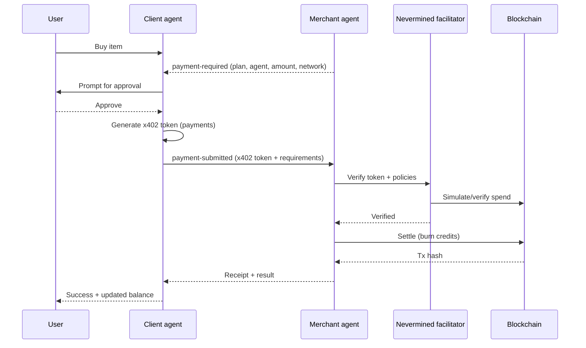

# Building Agentic Payments with Nevermined x402, A2A, and AP2

### How agents learn to trust, transact, and settle on-chain

AI agents today can research, negotiate, and collaborate—but when it comes to handling payments, everything suddenly becomes messy. Custom logic everywhere. Fragile approval flows. No standard way to express or enforce what an agent is allowed to spend. And worst of all, no clear trust model for users.

Nevermined’s integration with **x402**, **A2A**, and **AP2** introduces a clean, safe, programmable way for agents to make payments with real on-chain settlement. The result is a system where users stay in control, product teams gain a consistent pricing layer, and engineers no longer have to reinvent payments inside every agent workflow.

In our latest demo, a client agent purchases from a merchant agent with explicit user approval and verifiable settlement. The flow is simple, auditable, and fully interoperable.

---

# TL;DR (Product)

AI agents shouldn’t just communicate—they should transact safely.  
Nevermined x402 introduces programmable, on-chain payment permissions enforced by smart account policies.  
A2A provides secure agent-to-agent messaging, AP2 expresses payment context, and x402 guarantees that agents can only spend what the user explicitly authorizes.

In the demo, a client agent buys from a merchant agent with real on-chain settlement. Every step—request, approval, transfer, receipt—is validated and enforced by protocol design.

---

# TL;DR (Engineering)

- The client agent mints x402 access tokens using `payments` ([payments-py](https://github.com/nevermined-io/payments-py)).
- These tokens encode scoped spend permissions: plan, agent, amount, network, scheme.
- The merchant verifies and settles through the Nevermined facilitator.
- A2A transports payment-required and payment-submitted messages.
- AP2 standardizes payment metadata.
- Smart-account policies enforce the allowed spend on-chain.

All code is reproducible in the demo:  
https://github.com/nevermined-io/a2a-x402/blob/feat/a2a-nvm/python/examples/adk-demo/README.md

---

# Why Agentic Payments Matter

If agents are going to participate in real commerce, they need:

- Clear, bounded permissions
- Explicit user approval
- Predictable pricing
- Transparent receipts
- Guardrails that prevent overspending or unauthorized actions

Nevermined x402 provides exactly that.  
AP2 standardizes payment intent, A2A transports messages, and x402 enforces permissions using smart-account policies.

Crucially, plans, SKUs, quotas, and pricing models live in the **policy layer**, not in each agent’s code. Changing pricing or adding new products becomes a config update—no agent refactoring required.

Because settlement is on-chain, businesses get:

- deterministic receipts
- auditability
- finality
- reduction in payment-related integration bugs

The demo shows a subscriber agent purchasing from a merchant agent with real settlement, verification, and user-controlled permissions.

---

# How A2A, AP2, and x402 Fit Together

### A2A — Communication Layer

A reliable messaging rail enabling structured, secure agent-to-agent conversations.

### AP2 — Payment Intent Layer

A standardized schema encoding:

- plan
- amount
- network
- pricing scheme
- merchant agent
- metadata

### x402 — Permission + Enforcement Layer

x402 turns intent into enforceable permissions.  
The x402 token created by the client agent specifies:

- which plan may be used
- which merchant agent is allowed
- max spend
- scheme (credits / PAYG)
- network
- validity window

The merchant validates the token via the facilitator before executing any payment logic.

Together they provide a clean mental model:

> **A2A** keeps the conversation coherent  
> **AP2** keeps the payment intent explicit  
> **x402** keeps the spend enforceable

---

# Flow Overview

The demo implements the following transaction sequence:

1. User instructs client agent to purchase something.
2. Merchant sends an AP2 `payment-required` message describing plan, amount, scheme, network.
3. Client asks user for approval.
4. User approves.
5. Client generates an x402 token with allowed permissions.
6. Client sends `payment-submitted` with x402 token + metadata.
7. Merchant calls facilitator to verify token/policies.
8. Facilitator simulates spend and returns validation.
9. Merchant settles on-chain (burns credits or deducts PAYG).
10. Merchant returns receipt + transaction hash.
11. Client updates the user’s balance and displays success.

You can inspect real demo transactions:

- Pay-as-you-go: [https://sepolia.basescan.org/tx/0xf88cb8217505c25d8225c803332b4da6b4c18f93a51b384d4fdc0a9205512b7c](https://sepolia.basescan.org/tx/0xf88cb8217505c25d8225c803332b4da6b4c18f93a51b384d4fdc0a9205512b7c)

- Credits plan: [https://sepolia.basescan.org/tx/0xe476f4612bd2293954f64f493f04239a7867efcbc522e00daec6732a1ce6e5f3](https://sepolia.basescan.org/tx/0xe476f4612bd2293954f64f493f04239a7867efcbc522e00daec6732a1ce6e5f3)

---

# Sequence Diagram

---

# The Facilitator’s Role

The facilitator is the enforcement and settlement engine for x402. It:

- validates x402 tokens
- checks smart-account policies
- simulates spend on-chain
- executes settlement (burn or deduct)
- returns canonical receipts

This enables product teams to:

- change pricing models without altering agent logic
- mix credit plans, PAYG, subscriptions, or hybrid models
- guarantee safe and predictable spending patterns

## For engineering teams, the facilitator becomes the single integration point for all settlement behavior.

# Smart Account Policies and x402 Permissions

Smart account policies define:

- which plans exist
- what merchants are allowed
- how many credits a token can burn
- on which chain or scheme the payment may occur
- how long permissions remain valid

For users, this means strong protection:

- no paying unauthorized agents
- no accidental overspending
- no ambiguous or hidden charges

For businesses, this means enforceable monetization with predictable guardrails.

## x402 ensures these policies are not optional—they are cryptographically enforced.

# Why This Pattern Scales

This architecture decouples business logic from payment logic:

- A2A: communication
- AP2: intent semantics
- x402: permissions
- Facilitator: verification and settlement

This modularity ensures:

- monetization evolves independently from agent capabilities
- agents can interoperate across ecosystems
- safety and consent become core features, not add-ons
- enterprise guardrails become programmable

This is the foundation for agentic commerce: agents that transact deliberately, safely, and verifiably.

---

# Try the Demo

Explore the full implementation here:

👉 https://github.com/nevermined-io/a2a-x402/blob/feat/a2a-nvm/python/examples/adk-demo/README.md

The repo includes:

- agent setup
- environment configuration
- x402 token generation
- facilitator verification
- AP2 messaging
- real Base Sepolia settlement
- logs, diagrams, and examples

---

# Scaling Beyond the Demo

With this pattern, agents can:

- Subscribe to services
- Charge for compute or data
- Orchestrate multi-agent workflows requiring payments
- Enforce enterprise-level budget controls
- Operate in marketplaces with trusted settlement

It unlocks a new category: **agentic commerce**.

---

# Key Takeaways

- Agents need safe, programmable ways to transact.
- x402 + Nevermined provides enforceable permissions and user-controlled spending.
- A2A/AP2 standardize communication and payment intent.
- Smart account policies act as a product-level control plane.
- The facilitator ensures verification and settlement are secure and final.
- The pattern is modular, interoperable, and ready for real-world agent commerce.

---

# References

- [payments-py SDK](https://github.com/nevermined-io/payments-py)
- [a2a-x402 demo README](https://github.com/nevermined-io/a2a-x402/blob/feat/a2a-nvm/python/examples/adk-demo/README.md)
- [x402 facilitator concept](https://x402.gitbook.io/x402/core-concepts/facilitator)
- [Nevermined x402 integration notes](https://github.com/nevermined-io/contracts/blob/main/docs/x402/NVM-x402_integration.md)
- [Nevermined + x402 positioning](https://www.linkedin.com/pulse/nevermined-x402-bridging-next-generation-payments-aitor-argomaniz-6ea1f/?trackingId=0kivr7zEZeiNP7jP7oAUmA%3D%3D)
